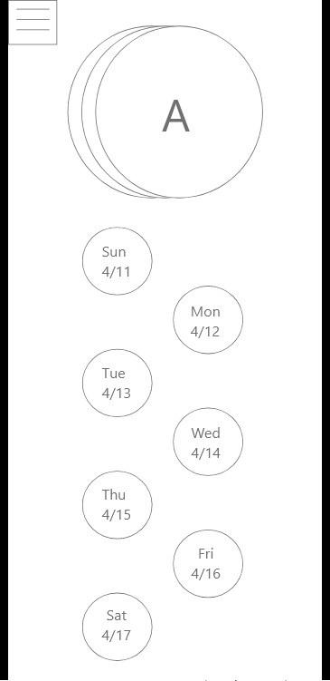
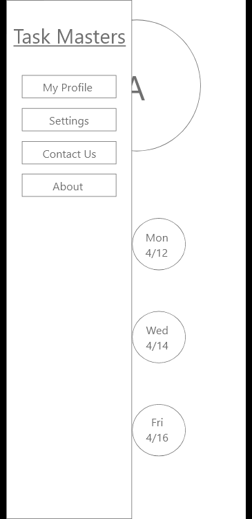
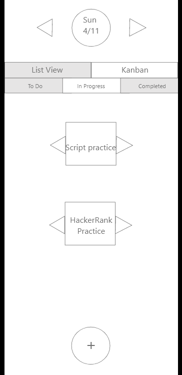

## Phase II: User-Centered Design

Group Members: Felicia Cruz, Joseph Macam, and Anthony Brackett

Project: Task Management System

## Executive Summary

* We used the data and information gathered from Phase 1 and used them as a framework for creating our wireframe.
* Using the wireframe, we began development of the interactive prototype using Adobe XD.

## Wireframe Artboards 
Note: The justifications should relate back to Phase 1 Scenarios/Personas
### Week Days Selection (Main landing page)
 
 

### Multiple Account Management
 

### Day's Task List
 
 

### Task Creation
 

### Day's Kanban
 

## Supplementary Materials

*** Adobe XD Prototype link goes here ***
