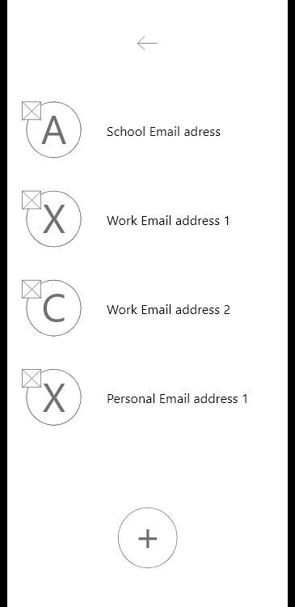
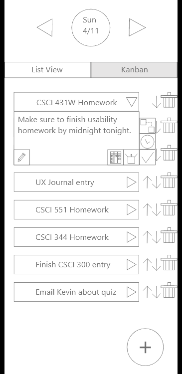

## Phase II: User-Centered Design

Group Members: Felicia Cruz, Joseph Macam, and Anthony Brackett

Project: Task Management System

## Executive Summary

* We used the data and information gathered from Phase 1 and used them as a framework for creating our wireframe.
* Using the wireframe, we began development of the interactive prototype using Adobe XD.

## Wireframe Artboards 
Note: The justifications should relate back to Phase 1 Scenarios/Personas
### Week Days Selection (Main landing page)
* Our main landing page shows will allow our user to view their schedules for the week. They can  choose which date from the to do list they would like to view, switch between multiple accounts, and access our navigation menu. Referring to our data we gathered from our contextual inquiry a key take away we found was that our user’s prefer using task management systems that are learnable and easy to use. In addition, we found that our personas (Sarah and John) were in need of a task management system that will allow them to stay organized and provide structure. Therefore, we created our main landing page to be very straight forward and unambiguous making it easy for our user’s to find their to-do lists and switch between accounts. 

 
 

### Multiple Account Management
* Our multiple account management page will allow our users to add/delete accounts. According to our data and our personas we found that a lot of our users how different time complexities and schedules. For example, our personas (Sarah and John) went to school and worked at the same time so this feature for multiple account management would be useful to them. Therefore, the reason we designed a multiple account management page is because we want our user’s to be able to have multiple accounts in case they need to switch between a variety of schedules (Ex: school, work, personal, and etc). 

 

### Day's Task List
* For the Day’s Task List page it allows our user’s to view their to-do list for the date they have chosen, view their tasks by order of priority, and add/delete tasks. In allowing our users to organize their tasks based on order of priority it will help keep them more organized, keep track of their tasks, and manage which tasks need to be completed sooner than others. We designed our page this way because according to our personas (Sarah and John) in their scenarios found themselves in situations where they were often forgetting to do certain tasks, but with this setup it will allow our users to keep track of all their tasks and order them by importance.  

 
 

### Task Creation
* Our Task Creation page will allow our user’s to create new tasks. According to our data we gathered and our personas (Sarah and John) our users can have incredibly busy schedules which can cause them to forget certain tasks they need to take care of. The reason we created this view is because it will allow our user’s to be able to create a task, give a description, and a priority. By giving our user’s an option to cerate tasks it will help them stay organized and remember which tasks they need to make sure they complete. 

 

### Day's Kanban
* Our Day Kanban view will allow our user’s to view their tasks but in a Kanban view instead of a list view. We designed this page to be easy to use for our user’s and allow them to keep track of tasks the need to do, have in progress, and have completed. Our justification for this view is the same as our justification for our Day’s Task list view. We designed our page this way because according to our personas (Sarah and John) in their scenarios found themselves in situations where they were often forgetting to do certain tasks. We this view it will help our user’s keep track of tasks they still need to and tasks they have already completed. 

 

## Supplementary Materials

*** Adobe XD Prototype link goes here ***
